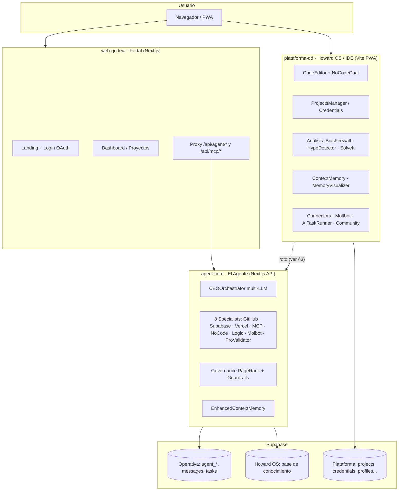

# Arquitectura del Ecosistema QodeIA

> Estudio de integración de todas las piezas del monorepo en una plataforma completa.
> Basado en lectura exhaustiva del código (commit `fdc0837`, 10-jul-2026).
> Complementa a `CLAUDE.md` (estado operativo) y al README (descripción general).

---

## 1. Las piezas y su rol en la visión

**Lectura de la visión implícita en el código:** QodeIA es una plataforma de
desarrollo asistido por agentes donde el usuario entra por el **portal**
(web-qodeia), trabaja en el **IDE** (plataforma-qd, cuya experiencia de
conocimiento/arquitectura se llama **Howard OS**), y toda petición inteligente
la resuelve **el Agente** (CEOOrchestrator delegando en specialists), que
persiste memoria operativa y consulta la base de conocimiento Howard OS.

**Qué es Howard OS exactamente** (según el propio código): no es hoy una app
separada, sino dos cosas: (a) una **segunda instancia de Supabase** usada como
base de conocimiento (`howardSupabase` en agent-core, `HOWARD_OS_URL` en
web-qodeia apuntando a un `localhost:3002` que no existe en el repo), y (b) la
identidad de la experiencia IDE ("Plataforma-qd: el entorno de desarrollo
(Howard OS)", según el README de web-qodeia).

---

## 2. Estado real de cada módulo del IDE (inventario de prototipos)

| Módulo | Líneas | Estado observado | Backend que usa |
|---|---|---|---|
| AITaskRunner | 374 | Implementado | `AgentApiClient` → **endpoints inexistentes** |
| BiasFirewall | 369 | Implementado | `fetch(AGENT_URL)/api/agent` **sin JWT** |
| HypeDetector | 364 | Implementado | ídem BiasFirewall |
| ContextMemoryPanel | 259 | Implementado | Supabase directo (`context_memory`) |
| CommunityPanel | 222 | Implementado | Supabase (`resources`, `profiles`) |
| MemoryVisualizer | 195 | Implementado | Supabase |
| NoCodeChat | 191 | Implementado | `fetch(AGENT_URL)` **sin JWT** |
| CredentialsPanel | 152 | Implementado | `SecureStorage` (localStorage ⚠️) |
| ProjectsManager | 101 | Básico | Supabase (`projects`) |
| CodeEditor | 97 | Básico (Monaco) | **Nada — aislado del agente** |
| SolveItIterator | 60 | **Prototipo** | — |
| MoltbotPanel | 58 | **Prototipo** (solo UI) | — |
| Connectors | 40 | **Prototipo** (solo UI) | — |

---

## 3. Los cuatro gaps que impiden que el ecosistema funcione como plataforma

### GAP 1 — Contrato de API roto (bloqueante)

La plataforma consume endpoints que **el agente no expone**:

| Cliente (plataforma-qd) | Endpoint consumido | ¿Existe en agent-core? |
|---|---|---|
| `AgentApiClient` | `POST /api/agent/chat` | ❌ |
| `AgentApiClient` | `POST /api/agent/execute` | ❌ |
| `AgentApiClient` | `GET/POST /api/agent/memory` | ❌ |
| `AgentApiClient` | `POST /api/agent/sync` | ❌ |
| `AgentApiClient` | `GET /api/health` | ❌ |
| `mcp-service` | `POST /api/agent/sync-solution` | ❌ |
| `mcp-service` | `POST /api/mcp/sync` | ❌ |
| BiasFirewall / HypeDetector / NoCodeChat | `POST /api/agent` | ✅ pero **sin Authorization → 401 siempre** |

El agente expone realmente: `POST /api/agent` (con JWT), `/api/agent/reload`,
`/api/mcp/{stats,test,auth/*,update-env}`. **Ningún flujo del IDE hacia el
agente funciona hoy de extremo a extremo.**

### GAP 2 — Identidad fragmentada

Tres configuraciones de Supabase distintas (portal, IDE, agente) y dos métodos
de login (OAuth Google en portal; password+Google en IDE). Si no apuntan al
**mismo proyecto** Supabase, el JWT emitido en una app no valida en el agente
(→ 401), y el usuario tiene que loguearse dos veces con cuentas distintas.

### GAP 3 — Datos divididos sin esquema unificado

Dos familias de tablas disjuntas — `agent_*`, `messages`, `tasks`,
`memory_vectors` (lado agente) vs `projects`, `credentials`, `profiles`,
`context_memory`, `project_files`, `agent_solutions` (lado IDE) — definidas en
7+ ficheros `.sql` dispersos sin migraciones. Nadie sabe qué existe realmente
en cada instancia. La "memoria de contexto" existe **duplicada** en ambos lados
(`agent_memory`+`memory_vectors` vs `context_memory`) sin sincronización real.

### GAP 4 — Credenciales del lado equivocado

`CredentialsPanel` guarda tokens de GitHub/Vercel/OpenAI en `localStorage`
cifrados con una clave que viaja en el bundle. El agente, que es quien de
verdad necesita esas credenciales (sus specialists llaman a GitHub/Vercel),
las lee de **variables de entorno del servidor**, no del usuario. Es decir:
hoy la plataforma es mono-usuario de facto — todos los usuarios operarían con
las credenciales del servidor.

---

## 4. Decisiones de arquitectura

### ADR-1 · Contrato de API entre IDE y Agente

**Opción A — El agente implementa el contrato que los clientes ya esperan**
(`/chat`, `/execute`, `/memory`, `/sync`, `/health` como fachadas finas sobre
CEOOrchestrator y CME).
✅ No se toca ninguno de los 13 módulos del IDE; los endpoints son 5 rutas
Next.js pequeñas; `/health` es trivial y necesario para observabilidad.
❌ Superficie de API más grande que mantener. **Score: 8/10**

**Opción B — Los clientes se reescriben contra el `/api/agent` único actual**
(action en el body).
✅ Una sola ruta; menos superficie.
❌ Hay que tocar `AgentApiClient`, `mcp-service` y 4+ módulos; un endpoint
"dios" con dispatch por action es peor para auth granular, rate limiting y
tipado. **Score: 5/10**

**Opción C — Gateway en web-qodeia como única puerta**
✅ Un solo dominio público.
❌ Añade un salto y acopla el IDE al portal; el proxy ya existe pero solo
cubre parte. **Score: 4/10**

**RECOMENDACIÓN: A.** Si eliges A renuncias a la mínima superficie de API a
cambio de no reescribir el IDE y ganar endpoints con semántica clara. El coste
real es bajo porque las cinco rutas delegan en código que ya existe
(CEOOrchestrator, EnhancedContextMemory).

### ADR-2 · Un proyecto Supabase o tres

**Opción A — Un único proyecto** con todas las tablas (`agent_*` +
plataforma + conocimiento con prefijo `kb_`).
✅ Un solo JWT válido en todo el ecosistema (resuelve GAP 2 de raíz), un solo
sitio para RLS y migraciones, cabe en free tier.
❌ Sin aislamiento de blast radius; límites de free tier compartidos. **Score: 9/10**

**Opción B — Dos proyectos** (operativa + Howard OS conocimiento), como
sugiere el código actual.
✅ Aislamiento del conocimiento; ya está medio montado.
❌ El JWT del usuario solo vale en uno; hay que federar auth o duplicar
usuarios; el free tier de Supabase pausa proyectos inactivos y duplica la
gestión. **Score: 6/10**

**Opción C — Tres proyectos** (uno por app).
❌ Todos los problemas de B multiplicados. **Score: 2/10**

**RECOMENDACIÓN: A.** Si eliges A renuncias al aislamiento físico del
conocimiento a cambio de identidad única y operación simple — con presupuesto
cero y un solo desarrollador, la operación simple gana. `howardSupabase` ya
hace fallback a las credenciales del agente cuando no se configura la segunda
instancia, así que el código actual es compatible con esta decisión sin tocarlo.

### ADR-3 · Qué es Howard OS en la arquitectura final

**Opción A — Capa de conocimiento, no app**: tablas `kb_*` + endpoints en el
agente (`/api/knowledge/*`) + los paneles que ya existen en plataforma-qd
(ContextMemory, MemoryVisualizer) como su UI.
✅ Cero apps nuevas; coherente con que el README ya llama Howard OS al IDE.
❌ El nombre deja de designar un servicio desplegable. **Score: 9/10**

**Opción B — Tercera app desplegada** (el `localhost:3002` que la config espera).
✅ Separación conceptual pura.
❌ Otra app que construir, desplegar y mantener sin que exista ni una línea
de ella en el repo. **Score: 3/10**

**RECOMENDACIÓN: A.** Si eliges A renuncias a un "Howard OS" como producto
separado a cambio de materializarlo ya con lo que existe. `HOWARD_OS_URL`
pasa a apuntar al agente.

### ADR-4 · Credenciales de usuario

**RECOMENDACIÓN (sin alternativa razonable):** tabla `user_credentials` en
Supabase cifrada server-side (pgsodium/Vault o cifrado en Edge Function), RLS
por `user_id`, y los specialists del agente leen de ahí con fallback a env
vars del servidor. `CredentialsPanel` pasa a escribir contra esa tabla vía el
agente. Se elimina `SecureStorage` de localStorage. Esto convierte la
plataforma en multi-usuario real y cierra el riesgo de seguridad ya documentado.

---

## 5. Roadmap de integración propuesto

**Fase 3A — Columna vertebral (lo que hace que "todo se hable")**
1. Esquema unificado: un `supabase/migrations/0001_unified.sql` con las tres
   familias de tablas + RLS. Archivar los 7+ SQL dispersos.
2. Los 5 endpoints del contrato en agent-core (`chat`, `execute`, `memory`,
   `sync`, `health`) + `sync-solution` y `mcp/sync` que espera `mcp-service`.
3. JWT único: las tres apps contra el mismo proyecto Supabase; los módulos del
   IDE que llaman al agente añaden `Authorization: Bearer` desde la sesión.
4. Smoke test E2E: login → NoCodeChat → respuesta del CEOOrchestrator → mensaje
   persistido → visible en ContextMemoryPanel.

**Fase 3B — Cerrar prototipos del IDE (en orden de valor)**
1. **CodeEditor ↔ Agente**: botón "pedir al agente" que envía el buffer como
   `editorContext` (el endpoint ya lo soporta — está implementado y sin usar).
2. **Connectors**: dejar de ser stub → UI sobre `mcp-service.getStats()` +
   `mcp/test` del agente (los endpoints ya existen).
3. **MoltbotPanel**: conectar al `MolbotSpecialist` vía `/api/agent` con
   `context: 'molbot'`.
4. **SolveItIterator**: completar sobre el patrón de BiasFirewall (mismo
   esqueleto de llamada al agente).
5. **CredentialsPanel** → migración a `user_credentials` (ADR-4).

**Fase 3C — Higiene estructural (del CLAUDE.md, sin cambios)**
Reubicar qodeia-arch, extraer agent-core a paquete puro + app, completar o
eliminar los paquetes esqueleto.

---

## 6. Checklist de verificación E2E (definición de "plataforma integrada")

- [ ] Un usuario se registra una vez y su sesión vale en portal, IDE y agente.
- [ ] `GET /api/health` del agente responde 200 y el IDE lo muestra.
- [ ] NoCodeChat, BiasFirewall y HypeDetector reciben respuesta real (no 401).
- [ ] CodeEditor envía código al agente y recibe sugerencias.
- [ ] La memoria escrita por el agente se ve en ContextMemoryPanel (misma tabla).
- [ ] Las credenciales del usuario viven en Supabase, no en localStorage.
- [ ] `supabase/migrations/` es la única fuente de verdad del esquema.
